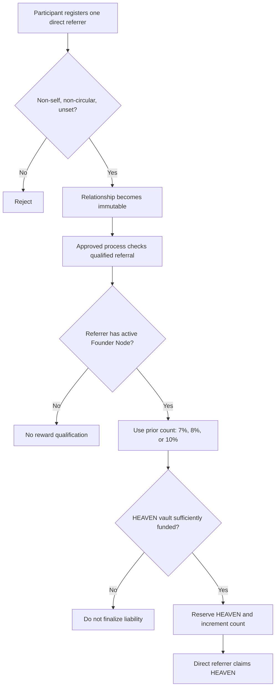

# Direct Referral Flow

```mermaid
flowchart TD
  Register[Participant registers one direct referrer] --> Validate{Non-self, non-circular, unset?}
  Validate -->|No| Reject[Reject]
  Validate -->|Yes| Lock[Relationship becomes immutable]
  Lock --> Qualify[Approved process checks qualified referral]
  Qualify --> Active{Referrer has active Founder Node?}
  Active -->|No| Reject2[No reward qualification]
  Active -->|Yes| Rate[Use prior count: 7%, 8%, or 10%]
  Rate --> Funded{HEAVEN vault sufficiently funded?}
  Funded -->|No| Pending[Do not finalize liability]
  Funded -->|Yes| Reserve[Reserve HEAVEN and increment count]
  Reserve --> Claim[Direct referrer claims HEAVEN]
```

No second-level path exists. The eligible base and qualification definition remain open.

