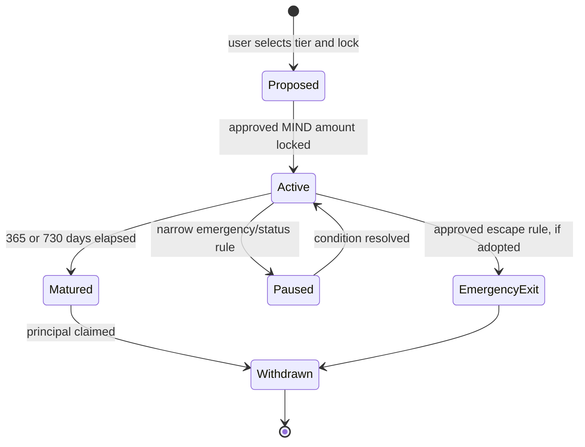

# Founder Node Lifecycle

```mermaid
stateDiagram-v2
  [*] --> Proposed: user selects tier and lock
  Proposed --> Active: approved MIND amount locked
  Active --> Matured: 365 or 730 days elapsed
  Active --> Paused: narrow emergency/status rule
  Paused --> Active: condition resolved
  Active --> EmergencyExit: approved escape rule, if adopted
  Matured --> Withdrawn: principal claimed
  EmergencyExit --> Withdrawn
  Withdrawn --> [*]
```

Exact tier amounts, early/emergency exit, transfer, inheritance, and reward effects are open decisions.

