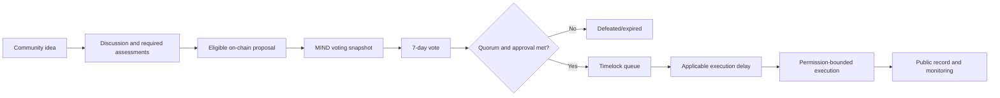

# Governance Flow

```mermaid
flowchart LR
  Idea[Community idea] --> Review[Discussion and required assessments]
  Review --> Proposal[Eligible on-chain proposal]
  Proposal --> Snapshot[MIND voting snapshot]
  Snapshot --> Vote[7-day vote]
  Vote --> Check{Quorum and approval met?}
  Check -->|No| Defeated[Defeated/expired]
  Check -->|Yes| Queue[Timelock queue]
  Queue --> Delay[Applicable execution delay]
  Delay --> Execute[Permission-bounded execution]
  Execute --> Report[Public record and monitoring]
```

Ordinary baseline is 10% quorum, more than 50% approval, and 48 hours' delay. Enhanced classes remain subject to ratification.

