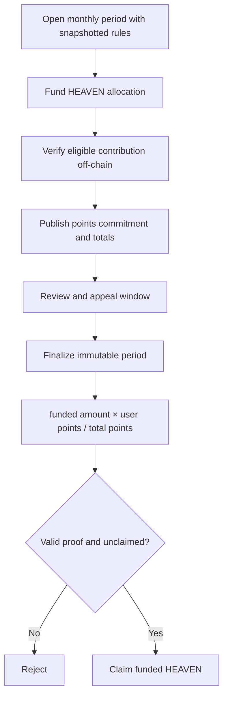

# MindGlobal Pool Flow

```mermaid
flowchart TD
  Open[Open monthly period with snapshotted rules] --> Fund[Fund HEAVEN allocation]
  Fund --> Verify[Verify eligible contribution off-chain]
  Verify --> Publish[Publish points commitment and totals]
  Publish --> Review[Review and appeal window]
  Review --> Finalize[Finalize immutable period]
  Finalize --> Formula[funded amount × user points / total points]
  Formula --> Proof{Valid proof and unclaimed?}
  Proof -->|No| Reject[Reject]
  Proof -->|Yes| Claim[Claim funded HEAVEN]
```

Governance may update future BPS and point weights only. Aggregate distributions cannot exceed period funding.

