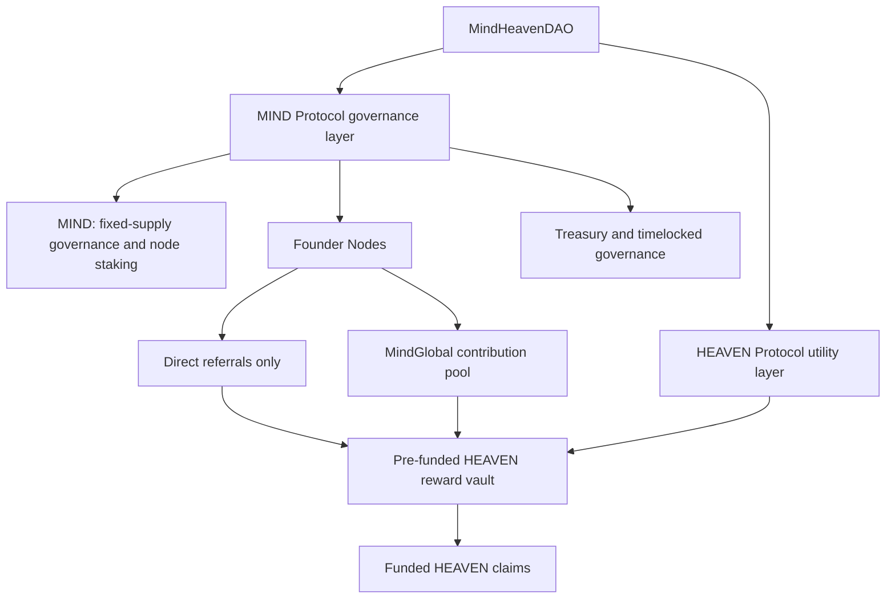

# Protocol Overview

```mermaid
flowchart TD
  Brand[MindHeavenDAO] --> Gov[MIND Protocol governance layer]
  Brand --> Utility[HEAVEN Protocol utility layer]
  Gov --> MIND[MIND: fixed-supply governance and node staking]
  Gov --> Nodes[Founder Nodes]
  Gov --> Treasury[Treasury and timelocked governance]
  Utility --> Vault[Pre-funded HEAVEN reward vault]
  Nodes --> Direct[Direct referrals only]
  Nodes --> Global[MindGlobal contribution pool]
  Direct --> Vault
  Global --> Vault
  Vault --> Rewards[Funded HEAVEN claims]
```

The pool is a contribution mechanism, not a second referral level. No arrow represents a guaranteed return.

