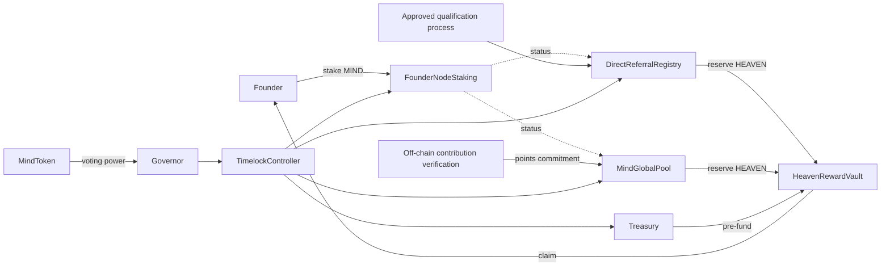

# Contract Interaction Map

Dashed status reads do not confer mutation authority. Reward accounting modules authorize reservations; the vault controls custody and settlement. Proposed names are not final.

