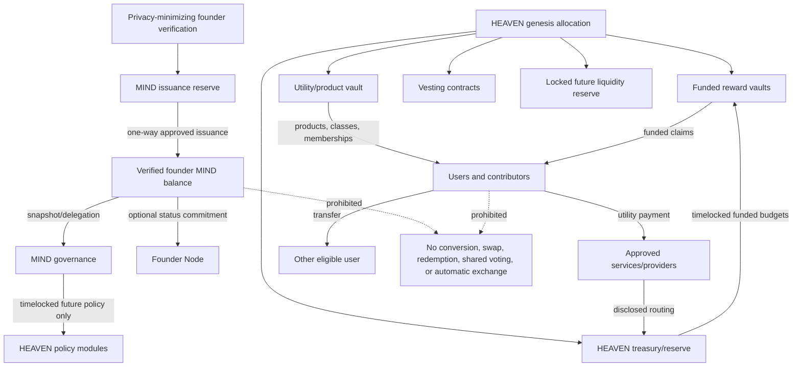

# MIND Protocol Dual-Token Architecture — Step 2 v0.1

**Status:** Draft for founder, legal, economic, and security review

**Scope:** Architecture and launch recommendation only

**Target:** BNB Smart Chain initially, EVM-compatible where practical

**Exclusions:** No production Solidity, token deployment, sale, liquidity launch, price promise, guaranteed return, or approved economic commitment

## 1. Executive decision summary

MindHeavenDAO should launch with two deliberately separate assets:

- **MIND** is a non-tradable, non-transferable Founder Token. It represents verified founder identity, reputation, and binding governance rights. It must not be sold, exchanged, listed, pledged, or converted into HEAVEN.
- **HEAVEN** is a transferable ecosystem utility and reward token. It can support products, classes, memberships, contribution rewards, and later carefully controlled utility staking. Holding HEAVEN does not provide binding protocol governance or a claim on MIND.

The safest first launch is **Model 1: Utility and rewards**, with no yield-bearing staking and no protocol-sponsored liquidity pool. It creates demand from real services before adding financial complexity. Model 2 should be considered only after utility usage, funding, legal review, and independent audits are demonstrated. Model 3 should be deferred until governance and treasury controls are mature.

All figures and controls marked **Recommended** require founder approval. No open item is silently treated as final.

## 2. Step 1 review and required reconciliation

Step 1 correctly separated MIND governance from HEAVEN utility/rewards, fixed the MIND maximum supply at 20,000,000, prohibited MIND-denominated rewards, required pre-funded HEAVEN liabilities, and documented multisig, timelock, pause, and progressive decentralization controls.

Step 2 changes or clarifies three Step 1 assumptions:

1. Step 1 described MIND using standard ERC-20 transfer functions and left transferability open. Step 2 proposes that founder-held MIND balances cannot transfer or approve transfers.
2. Step 1 referred to MIND as a Founder Node staking token. Step 2 should interpret “staking” as a non-custodial governance lock or active-node commitment, not a yield-bearing investment. Locked MIND earns no MIND and creates no guaranteed HEAVEN entitlement.
3. Step 1 allocated 5,000,000 MIND to the Foundation/protocol treasury. Because MIND is now founder-only, this reserve must not become tradable treasury inventory or voting power. It should remain in a non-voting issuance reserve and may move only through the verified-founder issuance process, subject to founder-approved rules.

After approval, the Constitution, technical specification, and open-decisions register should be amended in a separate change. This Step 2 draft does not rewrite Step 1 history.

## 3. Dual-token separation

| Property | MIND — Founder Token | HEAVEN — Utility Token |
|---|---|---|
| Primary purpose | verified founder identity, reputation, governance | ecosystem access, payment, rewards, utility participation |
| Transferability | non-transferable | transferable |
| Tradability/listing | prohibited by design and policy | technically possible; no official market promised |
| Recipient eligibility | verified founding members only | eligible users, contributors, partners, treasury modules |
| Supply posture | fixed 20,000,000 at genesis; no later minting | fixed maximum with controlled release; exact cap open |
| Conversion | no MIND-to-HEAVEN or HEAVEN-to-MIND conversion | cannot acquire or redeem MIND |
| Binding governance | yes, with snapshot and anti-concentration rules | no |
| Rewards | never paid in MIND | may be paid in pre-funded HEAVEN |
| Economic rights | no equity, debt, revenue share, or profit right | no equity, debt, guaranteed yield, or treasury claim |
| Pausing | issuance/lock operations only; balances and votes cannot be confiscated | affected transfers, mint/release, claims, staking, or vault modules separately |

### 3.1 Legal separation

- Separate terms must explain each token's purpose, eligibility, restrictions, risks, and absence of ownership or return rights.
- MIND founder verification, governance, suspension, appeal, inheritance, privacy, and jurisdiction rules require counsel review before issuance.
- HEAVEN utility must be evidenced by usable products and services. Marketing must lead with access and consumption, not investment or price.
- No sale, contribution, purchase, staking, reward, or liquidity program launches without jurisdiction-specific token, consumer, referral, AML/sanctions, tax, privacy, and promotion review.
- The protocol must never promise listing, liquidity, price appreciation, redemption value, APY, passive income, or profit.
- Accounting, contracts, risk disclosures, and treasury reporting for MIND and HEAVEN must remain separate.

### 3.2 Technical separation

- Use separate contracts, roles, treasuries/vaults, accounting ledgers, events, audits, and front-end disclosures.
- Neither token contract may call a conversion, swap, redemption, or mint function on the other.
- MIND governance may authorize future HEAVEN parameters through a timelock, but cannot move individual HEAVEN balances or exceed HEAVEN hard caps and funded liabilities.
- HEAVEN balances, locks, or liquidity positions provide no binding MIND voting power.
- No shared proxy administrator should be able to upgrade both token cores in one action.
- Cross-contract integrations use minimal read-only interfaces and versioned adapters.

## 4. MIND architecture

### 4.1 Purpose and rights

MIND records verified founder membership and governance weight. Approved rights may include proposal sponsorship, voting, delegation, Founder Node activation, reputation attestations, and access to founder-only governance processes. MIND provides no ownership of a company, guaranteed reward, redemption right, or claim on treasury assets.

### 4.2 Supply and allocation

The Step 1 fixed maximum remains **20,000,000 MIND**, created once at genesis with no later mint function.

| Allocation | Amount | Step 2 treatment |
|---|---:|---|
| Verified Founder allocation | 15,000,000 | released only to verified founding members under an approved tier schedule |
| Founder continuity reserve | 5,000,000 | held in a non-voting issuance reserve; not treasury inventory; releasable only to verified founders under a timelocked, capped policy |

**Recommended:** unissued/reserve MIND has zero voting power, cannot be delegated, cannot be sold, and cannot be transferred to an exchange, liquidity pool, ordinary treasury wallet, or unverified address. Founder approval must set the reserve expiry and destination of unused units; permanent lock or burn are safer than treasury activation.

### 4.3 Issuance and identity

- A verified-founder issuer may release MIND from the genesis reserve once per approved allocation event.
- Recipient eligibility must be established off-chain using a privacy-minimizing verification process; personal documents never go on-chain.
- Each issuance records the policy version, amount, recipient, authorizer, and non-sensitive eligibility commitment.
- Self-service transfers, allowances, permit signatures, wrapping, bridging, and liquidity-pool deposits are disabled.
- Contracts must reject movement from founder balances. Any necessary recovery or inheritance uses a narrow governance-approved migration procedure, not a general transfer function.
- MIND cannot be converted, burned in exchange for, or used to purchase HEAVEN.

### 4.4 Governance

The Step 1 baseline remains proposed: one MIND equals one vote, seven-day voting, 10% ordinary quorum, more than 50% approval, and 48-hour execution delay. Step 2 recommends additional safeguards:

- use historical voting snapshots and delegation checkpoints;
- exclude unissued reserves, treasury/issuer contracts, timelock, and known protocol-owned addresses from voting and quorum denominators;
- apply a **recommended per-founder effective voting cap of 5%** for ordinary proposals, with the exact design requiring simulation and founder approval;
- require enhanced thresholds for upgrades, treasury policy, HEAVEN emissions, and constitutional changes;
- publish delegation concentration and conflicts;
- prevent vote buying through enforceable conduct rules and transparent delegation;
- separate reputation signals from token-weighted binding votes until an audited hybrid model is approved.

### 4.5 Locks and Founder Nodes

MIND may be committed to a 365-day or 730-day Founder Node status lock. Because MIND is already non-transferable, a lock should represent participation commitment and eligibility state rather than financial custody. A lock:

- does not generate MIND;
- does not guarantee HEAVEN;
- does not create an automatic APY;
- may qualify a founder for separately funded HEAVEN contribution/referral programs under published rules; and
- must define maturity, suspension, emergency exit, inheritance, and appeal before launch.

## 5. HEAVEN architecture

### 5.1 Launch utilities

HEAVEN may be used for:

- virtual wellness products and digital content;
- yoga, meditation, education, and approved event access;
- memberships, subscriptions, upgrades, and ecosystem service credits;
- contributor, direct-referral, and MindGlobal Pool rewards from funded budgets;
- creator and partner settlement where legally and operationally approved;
- discounts, access tiers, and community feature activation; and
- non-binding DAO participation such as proposal signaling, community curation, and eligibility to apply for ecosystem grants.

Binding constitutional, treasury, upgrade, and parameter governance remains with eligible MIND governance. HEAVEN must not become a back door to MIND or founder status.

### 5.2 Supply and minting

**Recommended architecture:** a fixed maximum supply with a one-time genesis mint into named, time-locked vaults. No unrestricted mint role. The exact maximum is an open founder decision that must follow demand, liability, product-pricing, and stress modeling rather than selecting a promotional number.

If founders reject a genesis mint, the only acceptable alternative is a hard-capped emission controller with immutable lifetime cap, epoch ceilings, timelocked schedules, and no emergency mint authority. An uncapped or discretionary mint model is not recommended.

### 5.3 Recommended allocation percentages

Percentages apply to the founder-approved HEAVEN maximum supply:

| Allocation | Recommended share | Release control |
|---|---:|---|
| Ecosystem utility and funded rewards | 40% | annual/quarterly budgets; claim vaults; no unfunded promises |
| MindGlobal Pool and verified contribution | 15% | funded periods; immutable finalization; unclaimed policy required |
| Protocol treasury and resilience reserve | 20% | multisig plus timelock; published budgets and reconciliation |
| Product, community, and ecosystem growth | 10% | milestone-based grants; recipient vesting where appropriate |
| Core contributors | 10% | recommended 48-month linear vesting with 12-month cliff |
| Future liquidity reserve | 5% | locked and non-circulating at first launch; use requires separate major vote and legal review |

There is no recommended public-sale allocation in the first launch. Percentages, cap, recipient definitions, vesting start, and treatment of unused allocations require founder approval.

### 5.4 Release and emissions

- Annual and quarterly release ceilings must be approved before launch and cannot be increased for an active period.
- Rewards are liabilities only after HEAVEN is deposited into the relevant vault and reserved.
- Product emissions should be linked to verified usage, contribution, or service delivery—not wallet balance alone.
- Referral and MindGlobal rules remain direct-only and contribution-based as documented in Step 1.
- Treasury, team, partner, and liquidity allocations do not count as circulating until transferable.
- Publish maximum, released, circulating, locked, reserved, claimed, burned, and treasury-held amounts.
- Emergency powers cannot mint, accelerate vesting, or exceed an epoch ceiling.

### 5.5 Burning and sinks

**Recommended first launch:** no automatic transaction tax and no automatic burn. Automatic burns add complexity and can encourage price narratives.

Utility payments should use a disclosed routing policy: service-provider settlement, treasury recycling, or explicit consumption. Later, MIND governance may permanently burn unused or returned treasury HEAVEN through a timelocked public action. It may never burn user balances. A burn does not justify claims of scarcity-driven appreciation.

### 5.6 Vesting

- Core contributors: recommended 12-month cliff followed by 36 months of linear vesting (48 months total).
- Product/community grants: milestone release or 12–36-month linear vesting according to grant risk.
- Strategic partners, if approved: minimum 24-month vesting with performance milestones and termination rules.
- Liquidity reserve: fully locked through Phase 1; no release without a separate major governance proposal.
- Reward allocations: released by funded epoch or finalized period, not conventional insider vesting.
- No administrator may accelerate vesting during an active schedule except through a pre-defined beneficiary-protective rule approved before the schedule starts.

### 5.7 Staking and rewards

No yield-bearing HEAVEN staking should launch in Phase 1. If Phase 2 is approved, it should be **utility locking**, not an investment product:

- users voluntarily lock HEAVEN for access, discounts, service capacity, curation, or non-binding community participation;
- any HEAVEN incentive is paid from a pre-funded epoch budget, never newly created on demand;
- the reward rate is a bounded budget-distribution formula, not a guaranteed APY;
- no auto-compounding at launch;
- no reward solely for passive holding; utility use or verified contribution should matter;
- per-wallet and per-identity reward caps reduce concentration;
- early unlock, cooldown, penalty destination, and emergency exit must be approved;
- the contract displays remaining budget and cannot accrue beyond funding.

## 6. Launch-model comparison

| Model | Description | Benefits | Primary risks | Legal/technical complexity | First-launch suitability |
|---|---|---|---|---|---|
| 1. Utility and rewards | HEAVEN is earned or used for real services; rewards are pre-funded; no yield staking or official LP | clearest product purpose, measurable demand, bounded liabilities, easiest to pause and audit | weak early liquidity, reward farming, product adoption risk | Lowest of the three, but still requires token/consumer/privacy review | **Recommended** |
| 2. Staking model | users lock HEAVEN for utility benefits and potentially funded incentives | retention, predictable locked supply, stronger participation | yield expectations, unsustainable emissions, smart-contract and classification risk, whale advantage | Medium–high | Phase 2 only after usage and funding evidence |
| 3. Liquidity-pool/DAO model | protocol supplies or incentivizes DEX liquidity and expands on-chain DAO functions | market access, composability, broader participation | volatility, speculation, impermanent loss, manipulation, treasury loss, regulatory exposure, governance attacks | Highest | Defer to Phase 3; separate approval required |

### Recommendation

Adopt **Model 1** for the first launch. It best aligns token release with actual ecosystem use, keeps reward liabilities bounded, preserves separation between founder governance and transferable utility, and avoids making liquidity or yield the product. Model 2 may be added only as utility locking after independent modeling and audit. Model 3 must not be bundled into initial deployment.

## 7. Recommended phased launch

### Phase 0 — Approval and readiness

- founders approve every blocking item in Section 12;
- legal opinions cover target jurisdictions and all public communications;
- product catalog, HEAVEN pricing/accounting method, demand forecast, and liability stress tests are documented;
- token, issuance reserve, vault, vesting, treasury, pause, and governance designs receive independent audit;
- multisig signers, timelock, monitoring, incident response, and public reporting are tested on testnet.

### Phase 1 — Utility and funded rewards

- issue MIND only to verified founders under the approved allocation policy;
- activate MIND governance gradually with multisig/timelock safeguards;
- release HEAVEN only for live products, services, contribution rewards, direct referrals, and finalized MindGlobal periods;
- prohibit official HEAVEN staking incentives and protocol-sponsored liquidity;
- publish monthly supply, vault solvency, reward, concentration, and treasury reports;
- set conservative per-period reward and recipient caps.

### Phase 2 — Optional utility locking

Entry conditions: sustained product use, at least two reconciled reward cycles, adequate treasury runway, no unresolved critical incident, independent audit, economic stress test, and founder/legal approval.

- introduce time-bounded HEAVEN utility locks with no guaranteed return;
- fund any incentives in advance and cap them by epoch and participant;
- monitor concentration, churn, reward cost, and real utility conversion;
- retain an emergency principal/utility unlock path under narrow conditions.

### Phase 3 — Optional liquidity and expanded DAO

Entry conditions: mature governance, clear legal path, treasury risk policy, market-manipulation monitoring, independent LP review, and a separate major governance vote.

- if approved, release only a capped portion of the locked 5% liquidity reserve;
- use transparent LP mandates, exposure limits, and exit rules;
- do not guarantee liquidity, price, or loss protection;
- HEAVEN participation may support signaling and community programs but does not replace MIND governance.

## 8. Token-flow diagram

## 9. Treasury and control architecture

- Separate MIND issuance reserve, HEAVEN treasury, HEAVEN reward vaults, vesting vaults, and optional future liquidity vault.
- Recommended launch multisig: at least **3-of-5**, with independent signers, hardware wallets, documented backups, geographic/organizational diversity, and no single operational team controlling the threshold. Exact threshold is open.
- All non-emergency parameter, release, upgrade, role, and treasury actions pass through a timelock. Ordinary delay starts at the Step 1 48-hour baseline; high-impact actions should use at least seven days.
- Per-transaction and rolling-period treasury limits require a higher approval class above founder-approved thresholds.
- Reward liabilities are reserved before finalization and cannot be withdrawn by treasury.
- Public dashboards reconcile on-chain balances with maximum, allocation, released, locked, circulating, reserved, claimed, and burned supply.
- Treasury may not support MIND trading or use MIND as collateral.
- Protocol-owned HEAVEN liquidity, if ever approved, is segregated and governed by a written risk mandate.

## 10. Anti-whale, anti-dump, and security safeguards

“Anti-dump” controls should mean transparent release discipline, not confiscation, blacklist functions, hidden taxes, or promises to support price.

### MIND safeguards

- non-transferability, no approvals, no wrapping/bridging, verified issuance only;
- non-voting issuance reserves and protocol accounts;
- proposed effective voting cap, snapshot voting, delegation visibility, enhanced proposal classes;
- per-founder issuance maximum and duplicate-identity controls;
- no emergency seizure, arbitrary balance adjustment, or administrator vote reassignment.

### HEAVEN safeguards

- fixed maximum and genesis allocation or immutable capped-emission alternative;
- vesting, cliffs, epoch release ceilings, recipient reward caps, and concentration monitoring;
- no transfer tax, blacklist, hidden balance adjustment, or discretionary emergency mint;
- vault solvency invariants and pull-based claims;
- optional circuit breakers based on contract safety or oracle failure—not market price support;
- token/DEX monitoring and public incident communication;
- no official liquidity during Phase 1 and no undisclosed market operations.

### Emergency pause

- pause each module separately: issuance, reward reservation, claims, utility locking, treasury release, and future LP management;
- ordinary user-to-user HEAVEN transfer pausing should be omitted unless legal/security review proves it essential; if present, it must be time-limited and tightly governed;
- pausing cannot mint, burn user funds, accelerate vesting, change MIND ownership, rewrite finalized reward periods, or redirect claims;
- prolonged pauses trigger a public review and safe-exit procedure where technically possible.

### Upgrade controls

- MIND token core, MIND supply, transfer restriction, and HEAVEN lifetime cap should be immutable.
- Prefer versioned migration for custody and reward modules; use bounded proxies only when migration cannot meet a documented need.
- Every upgrade requires published code, storage-layout checks, tests, independent review, multisig approval, and timelock.
- Emergency upgrades are prohibited; emergencies pause first, then follow an expedited but still reviewed and delayed process approved in advance.
- Separate upgrade authorities reduce correlated compromise between MIND and HEAVEN.

## 11. Risk and security checklist

### Architecture and economics

- [ ] MIND non-transferability cannot be bypassed through approvals, permits, wrappers, bridges, recovery, or NFT transfer.
- [ ] Issuance reserves cannot vote, delegate, trade, or move outside verified-founder issuance.
- [ ] HEAVEN maximum, allocation, vesting, and release ceilings reconcile exactly.
- [ ] Reward liabilities cannot exceed funded HEAVEN.
- [ ] Product demand and worst-case reward liabilities are independently stress-tested.
- [ ] No MIND/HEAVEN conversion or shared balance accounting exists.
- [ ] No reward formula promises APY or payment merely for passive holding.
- [ ] Team, grant, treasury, reward, and future LP supply are distinguishable on-chain.

### Governance and operations

- [ ] Multisig signer independence, threshold, rotation, recovery, and incident drills are complete.
- [ ] Timelock delays and enhanced proposal classes are implemented and tested.
- [ ] Treasury and issuance reserves have different roles and operational policies.
- [ ] Protocol-owned addresses are excluded from MIND voting and quorum as approved.
- [ ] Governance concentration, delegation, and HEAVEN holder concentration are reported.
- [ ] Off-chain verification has evidence standards, privacy controls, conflicts rules, and appeals.

### Smart-contract security

- [ ] Unit, integration, fuzz, invariant, permission, pause, upgrade, and migration tests pass.
- [ ] Reentrancy, token quirks, rounding, timestamp boundaries, signature replay, and duplicate claims are tested.
- [ ] Independent audit findings are remediated and verified.
- [ ] Bug bounty, monitoring, alerting, incident response, and communication plans are funded.
- [ ] Mainnet deployment addresses, bytecode, roles, and multisig configuration are independently verified.

### Legal, privacy, and communication

- [ ] Jurisdiction-specific token, governance, referral, consumer, AML/sanctions, tax, and promotion review is complete.
- [ ] MIND verification minimizes data and keeps identity documents off-chain.
- [ ] HEAVEN has live, clearly described utility before public distribution.
- [ ] Terms do not promise profit, price, listing, liquidity, guaranteed rewards, equity, or medical outcomes.
- [ ] Founder, contributor, partner, and user communications use approved language and risk disclosures.

## 12. Founder decision checklist

Every unchecked item requires explicit founder approval before implementation. Legal/security approval may also be required.

### MIND

- [ ] Ratify MIND as non-transferable, non-tradable, non-convertible, and founder-only.
- [ ] Ratify the fixed 20,000,000 genesis supply under the new non-transferable model.
- [ ] Approve 15,000,000 founder issuance allocation and treatment of the 5,000,000 continuity reserve.
- [ ] Approve exact MIND amount and eligibility for each Founder Node tier and lock duration.
- [ ] Approve founder verification, privacy, duplicate prevention, jurisdiction restrictions, and appeal process.
- [ ] Approve whether and how recovery, inheritance, revocation, suspension, or wallet migration can occur without creating transferability.
- [ ] Approve reserve expiry and whether unused MIND is permanently locked or burned.
- [ ] Approve governance proposal threshold, quorum denominator, delegation rules, and protocol-address exclusions.
- [ ] Approve, reject, or replace the recommended 5% effective per-founder voting cap.
- [ ] Approve major and constitutional proposal thresholds and delays.
- [ ] Confirm Founder Node locks create status/participation rights only and no guaranteed reward.

### HEAVEN

- [ ] Approve the exact HEAVEN maximum supply after independent economic modeling.
- [ ] Approve genesis mint versus immutable capped-emission controller; genesis mint is recommended.
- [ ] Approve or revise the recommended 40/15/20/10/10/5 allocation percentages.
- [ ] Approve circulating-supply definition and public reporting method.
- [ ] Approve annual/quarterly release ceilings and modification rules.
- [ ] Approve live launch utilities, product pricing method, accepted payment assets, refunds, and provider settlement.
- [ ] Approve referral reward base, qualified-referral definition, funding source, and claim rules.
- [ ] Approve MindGlobal eligible budget, point weights, verification, appeals, rounding, and period dates.
- [ ] Approve exact vesting schedules, beneficiaries, milestones, termination, and unused allocation handling.
- [ ] Approve no automatic burn at launch and conditions for future treasury burns.
- [ ] Approve claim deadlines and treatment of unclaimed HEAVEN.
- [ ] Approve whether HEAVEN user transfers can ever be paused and under what maximum duration.
- [ ] Approve Phase 2 utility-lock conditions, cooldowns, caps, early unlock, and funded incentive formula—or reject staking entirely.
- [ ] Approve prohibition on official Phase 1 liquidity and the Phase 3 entry criteria.

### Treasury, security, governance, and law

- [ ] Approve multisig threshold/signers and demonstrate signer independence and recovery.
- [ ] Approve timelock delays, transaction limits, budgets, reserve policy, and reporting cadence.
- [ ] Approve immutable versus migration/proxy treatment for every component.
- [ ] Approve emergency roles, module-specific pause powers, maximum pause duration, and safe exits.
- [ ] Approve oracle policy or confirm no oracle dependence at launch.
- [ ] Approve audit scope/providers, remediation verification, bug-bounty budget, and launch security gate.
- [ ] Approve Foundation jurisdiction, DAO legal wrapper, launch jurisdictions, and legal opinions.
- [ ] Approve privacy impact assessment, retention, processor, breach, and data-subject-rights model.
- [ ] Approve official communication rules prohibiting investment, guaranteed-return, price, listing, equity, and unsupported wellness claims.
- [ ] Approve the Phase 0–3 launch gates and identify who certifies each gate.

## 13. Approval gate and next step

This architecture should remain a draft until founders resolve Section 12 and qualified legal, economic, privacy, and security reviewers sign off on their areas. Approval of this document does not deploy a token, authorize a sale, fund a reward, create liquidity, or guarantee any benefit.

**Recommended next step:** hold a structured founder decision session, record each approved choice in the decision log, amend the Step 1 Constitution/specifications for consistency, and only then produce testable non-production interfaces and economic simulations.
